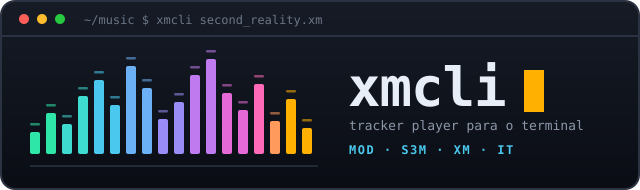

<div align="center">



**Player de música tracker para o terminal.**
Interface inteiramente em ASCII colorido e animado, no espírito do Winamp.

[](CLAUDE.md#12-roteiro-de-execução--do-zero-a-100-)
[](LICENSE)
[](docs/ADR-0001-linguagem.md)
[](docs/REQUISITOS.md#31-carregadores-de-formato-rf-100)
[](#instala%C3%A7%C3%A3o)
[](#a-interface)

</div>

---

> **Estado atual: fase F0 concluída (etapas 0 a 2).** Lê os quatro formatos, descreve com
> `--info`, e renderiza áudio pelo motor externo — para WAV, para `stdout` ou para o
> dispositivo. Ainda não há interface: o palco de visualização começa na etapa 4. Acompanhe
> pelo [roteiro de execução](CLAUDE.md#12-roteiro-de-execução--do-zero-a-100-).

## O que é

`xmcli` toca módulos de tracker — os arquivos `.mod`, `.s3m`, `.xm` e `.it` que moveram a
demoscene — direto no seu terminal, com fidelidade de reprodução comparável à do OpenMPT e uma
interface que não parece um relatório de log.

O modelo mental é o **Winamp**, não o FastTracker: janela compacta, título rolando, transporte,
playlist — e um **palco de visualização** que domina a tela.

## A interface

```
+------------------------------------------------------------------------------+
| xmcli  >> SPACE DEBRIS -- by Captain -- greetings to ... <<   [8]  spectrum   |
+------------------------------------------------------------------------------+
|                                                                              |
|                       P A L C O   D E   V I S U A L I Z A C A O              |
|                                                                              |
+------------------------------------------------------------------------------+
| 01:23 / 04:57  |<  >  ||  []  >|      VOL [########----]  BAL [----|----]    |
| [=================================o------------------------------------]     |
| XM  8ch  44.1kHz  BPM 125  SPD 06  ORD 07/2A  ROW 3C   LOOP  INTERP:cubic    |
+------------------------------------------------------------------------------+
```

Modos do palco, alternáveis por tecla ou em ciclo automático:

| Modo | O que faz |
|---|---|
| **Espectro** | FFT em escala logarítmica, bandas por oitava, picos em queda |
| **Osciloscópio** | Onda do master com trigger em cruzamento de zero — mono, estéreo, X/Y |
| **Barras flutuantes** | Por canal ou por banda, com física de ataque/decaimento e cor por instrumento |
| **Efeitos generativos** | Motor com realimentação e *warp* no espírito do MilkDrop, quantizado para ASCII colorido, com presets e ciclo automático |
| **Tracker view** *(opcional)* | A grade de padrões clássica, para quem quiser — como mais um modo, não como tela principal |

Além disso: **modo tela cheia**, **modo shade** de uma linha só (para deixar num canto do tmux),
**mixer de canais** com mute/solo por canal, temas de paleta, e detecção automática de
16 / 256 / truecolor com degradação graciosa.

## O diferencial técnico

Visualizadores de áudio comuns adivinham a batida com detectores de onset heurísticos. Aqui não
precisa: o replayer entrega **row, tick, BPM e disparo de nota por canal com precisão de
amostra**. As visualizações reagem à música em si, não a uma estimativa dela — dá para ligar um
efeito a "o instrumento 07 disparou no canal 3", algo que nenhum visualizador genérico alcança.

## Recursos previstos

- **Reprodução fiel** dos quatro formatos, incluindo os *quirks* de ProTracker, Scream Tracker 3,
  FastTracker II e Impulse Tracker dos quais os módulos reais dependem.
- Interpolação selecionável (nearest / linear / cúbica / sinc), volume ramping, filtro Amiga.
- Playlists `.m3u`, shuffle e repeat; navegação por order e por row.
- Exportação para WAV/FLAC mais rápida que tempo real e PCM cru em `stdout` para encadear
  com `ffmpeg`/`sox`.
- `--info --json` para uso em scripts; `--no-ui` para rodar mudo em pipeline.
- Contêineres comprimidos (`.zip`, `.gz`, `.xz`, `.mdz`, `PP20`) abertos direto.
- Binário único, sem runtime, para Linux, macOS e Windows.

## Instalação

> Pacotes prontos chegam na fase F5. Para compilar do código-fonte:

```console
$ sudo apt install libasound2-dev libopenmpt-dev   # Debian/Ubuntu
$ brew install libopenmpt                          # macOS
$ cargo build --release
```

O `libopenmpt` é o motor de reprodução da fase inicial (veja
[ADR-0001](docs/ADR-0001-linguagem.md)). A etapa 8 do roteiro traz o motor próprio e essa
dependência sai; até lá, `cargo build --no-default-features` compila tudo menos a reprodução.

## Uso

```console
$ xmcli second_reality.xm              # toca um módulo
$ xmcli ~/mods/                        # varre o diretório recursivamente
$ xmcli --info --json c.s3m            # metadados para script
$ xmcli --render out.wav d.xm          # render offline para WAV
$ xmcli --stdout d.xm | ffmpeg -f f32le -ar 44100 -ac 2 -i - saida.flac
$ xmcli --viz milkdrop --fullscreen a.it   # a partir da fase F2
$ xmcli --shade b.mod                      # a partir da fase F1
```

## Documentação

| Documento | Conteúdo |
|---|---|
| [`docs/REQUISITOS.md`](docs/REQUISITOS.md) | Requisitos funcionais e não funcionais, arquitetura, plano de fases, estratégia de testes e riscos |
| [`docs/ADR-0001-linguagem.md`](docs/ADR-0001-linguagem.md) | Escolha da linguagem e da stack, com as alternativas avaliadas |
| [`CLAUDE.md`](CLAUDE.md) | Orientações de desenvolvimento e princípios de código |

## Créditos e terceiros

O trabalho de engenharia reversa da comunidade OpenMPT, libxmp e MilkyTracker é o que torna
possível tocar esses formatos corretamente. `xmcli` se apoia nele.

A reprodução da fase inicial usa **libopenmpt** (BSD-3-Clause, © OpenMPT contributors) através
das crates `openmpt` e `openmpt-sys` (BSD-3-Clause-Attribution).

## Licença

[MIT](LICENSE).
